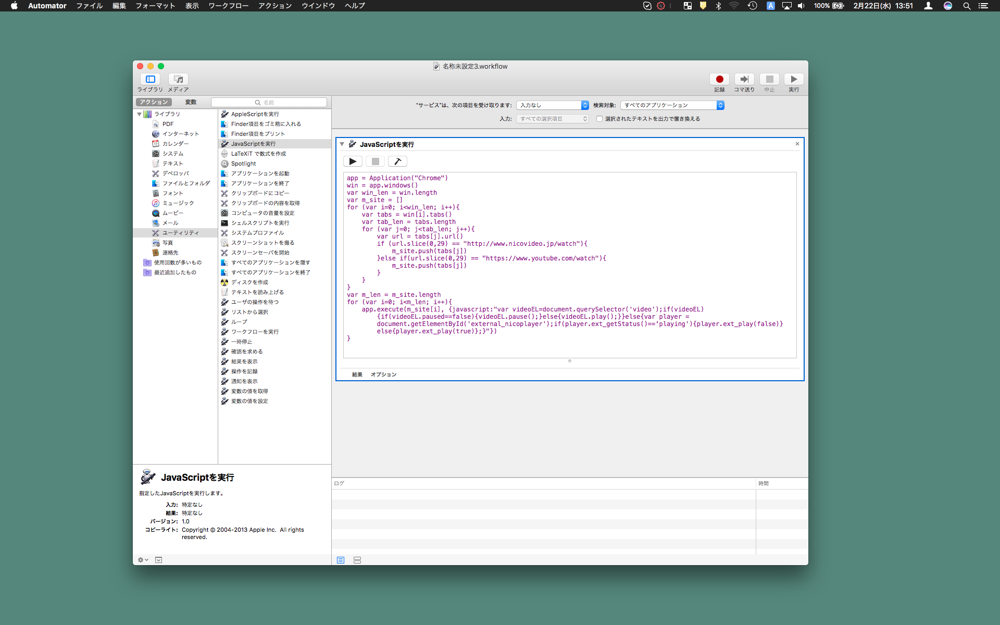
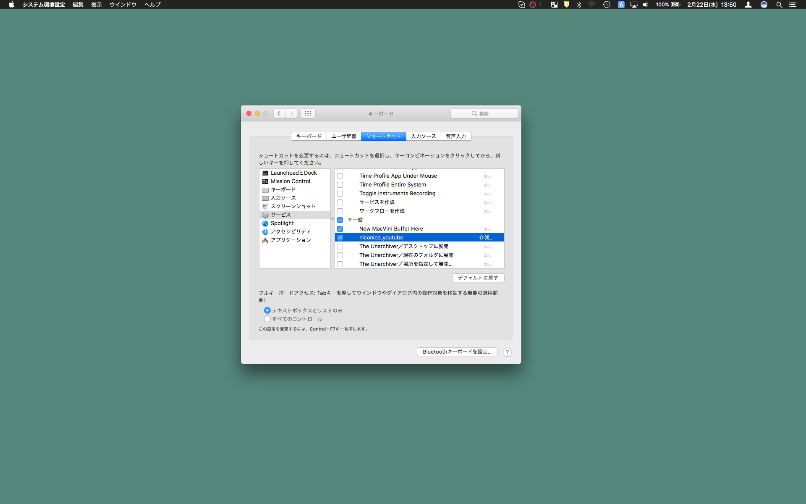

# niconico_youtube_applescript
MacのiTunesの一時停止・再生ボタンのように，YouTubeやニコニコ動画でも一時停止・再生がしたい．  
そこでApple Scriptを使って，どのアプリケーションにいてもGoogle Chrome上の動画を一時停止・再生できるスクリプトを作成．  
## 使い方(スクリプトの保存編)

1. アプリケーションの「Automator」を起動  
2. 「サービス」を選択  
3. 「アクション」->「ユーティリティ」->「JavaScriptを実行」を選択し，ワークフローに加える  
4. サービスは「入力なし」，検索対象は「すべてのアプリケーション」にする  
5. JavaSciptはniconico_youtube.jsのものをコピー・アンド・ペースト  
6. サービスの名前を適当にして保存
## 使い方(ショートカットキーの設定編)

1. 「システム環境設定」->「キーボード」->「ショートカット」を選択  
2. 「サービス」中から先程保存したAppleScriptを選択，ショートカットキーを設定  
